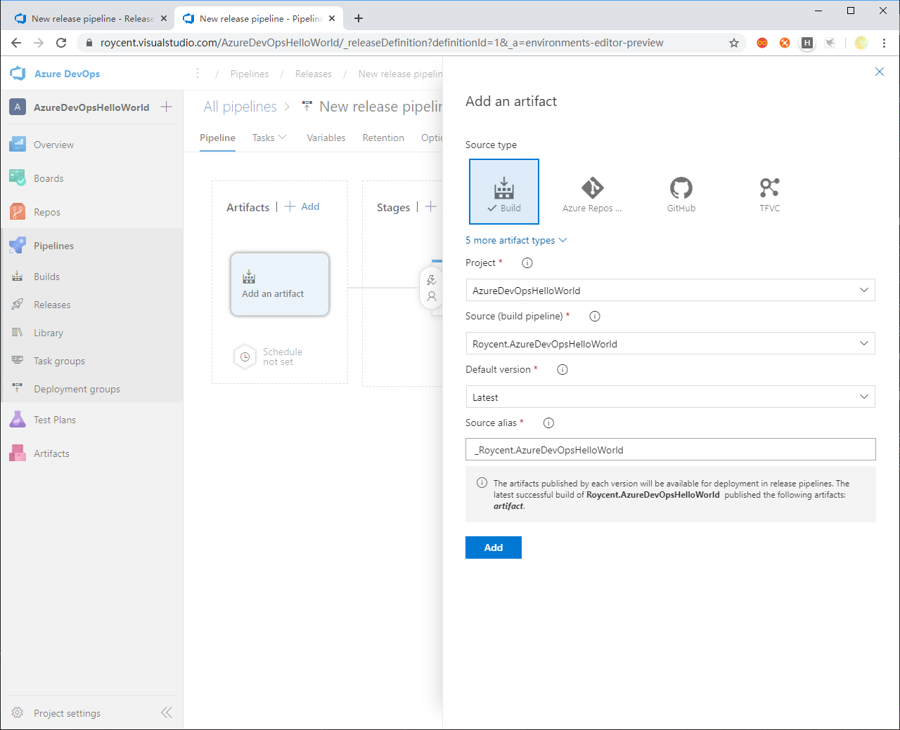

# Azure DevOps

- 创建项目

- 项目主页

- 创建新"Pipeline"

- 选择Github代码仓库

- 在代码仓库中加入Pipeline配置代码

- 选择Pipeline基础配置（之后还可以详细自定义配置文件）

- 编辑Pipeline配置文件

在默认的配置文件中，加入发布task一节；同时因为并没有编写测试，删除测试的那节

    ```yaml
    - task: PublishBuildArtifacts@1
      inputs:
        PathtoPublish: '$(Build.ArtifactStagingDirectory)'
        ArtifactName: 'artifact'
        publishLocation: 'Container'
    ```

- 执行`Save and run`，会在Github仓库中新增在上面编辑好的yaml配置文件，同时也可以自定义自己的提交信息

- Build成功

- 新建Release Pipeline

- 选择模板，以使用IIS发布为例

- 新建阶段

- 新建部署组

- 在要部署的服务器上复制右侧的脚本并运行即可

- 新建Release Pipeline，以在IIS上、web app deploy方式部署的网站为例

- 点击`Pipeline`，添加Artifact

- 然后点击右上角的`Save`和`Create Release`

- 点击`Deploy`

- 部署成功

## 常见错误

### 在release时报错

错误信息为`no package found with specified pattern`

默认的build配置中并没有生成artifact，所以要手动添加生成artifact

### 部署成功后网站仍无法访问

确认网站的类型，有些是无托管代码的，应用程序池要设置为无托管代码
